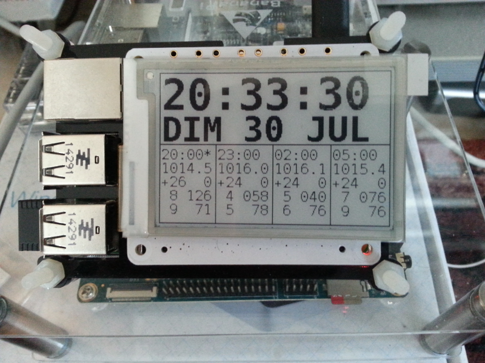

PaPiClock
=========

<h1>Introduction</h1>

Put that Raspberry Pi-2 into good use and build a PaPiClock for your elders!

This project is based on [PaPiRus project](https://www.pi-supply.com/product/papirus-epaper-eink-screen-hat-for-raspberry-pi/). You will need the library and framework found at the [PaPiRus Github repository](https://github.com/PiSupply/PaPiRus). Make sure you get one of the examples working first. The clock is indeed a good example since the software here was built upon it.

The clock automatically keeps up to date thanks to the Internet connection and NTP client. It is simply synchronized with the system clock which is synchronized to the NTP servers. NTP client is normally installed with the Raspbian distribution.

The weather forecast makes use of the free Infoclimat API. Infoclimat is a non profit association of weather enthusiasts making their weather prediction API freely available. Please visit their website at [http://www.infoclimat.fr](http://www.infoclimat.fr). Many thanks to them!

Thanks to Google Maps too for their geolocation API. You will need a user key for his one but it is freely available (see [here](https://developers.google.com/maps/documentation/geolocation/intro)). See next for how to implement the key in papiClock package.

<h1>How does it look like?</h1>

It still misses an outer case but you get the idea...

<h1>Prerequisites</h1>

  - A PaPiRus hat installed and working thanks to the [PaPiRus Python library](https://github.com/PiSupply/PaPiRus) already mentioned. Please note that this is for Python 2 (2.7) only. Although the sofware should adapt the font size depending on the size of the screen for better results choose the largest 2.7" screen.
  - A WiFi dongle or a working on board WiFi if you are using the Raspberry Pi 3
  - An Internet connection
  - A Google Map API key (see [here](https://developers.google.com/maps/documentation/geolocation/intro)) for geolocation with WiFi
  - `sudo apt-get install fonts-dejavu-core` to get the font used for the clock
  - `sudo apt-get install supervisor` for a convenient way to do clock start/stop/restart as a daemon controlled by supervisor (see next)
  - `sudo apt-get install ntp` to install NTP however it should come pre-installed with Raspbian
  
<h1>Installation</h1>

<h2>Install package</h2>

<h3>Before install</h3>

<h4>Logs directory</h4>

  - `mkdir ~/log`

<h4>WiFi geolocation</h4>

In order to be able to use WiFi geolocation at startup you need to save your Google Map API key in `./papiClock/googlekey.py` from the cloned repository (it is not saved in the repository for obvious reasons). The file is a simple line like this:

<pre><code>KEY="ABcdEfGHIJKL01MNOpQRSTu2vwXyZaBCDEF3g4H"
</code></pre>

Of course the key is made up you have to replace with your own.

<h3>Install</h3>

The most practical is to install as root in `/usr/local` like PaPiRus does. In the cloned repository do:

  - `sudo python setup.py install`

<h2>Control by supervisor</h2>

The best way to run the clock software `papiclock` is to drive it with `supervisor`. `supervisor` is a Python package that run commands as daemons and lets you start, stop, restart, ask status and even view logs using a web interface.

You will need a configuration file in `/etc/supervisor/supervisord.conf` like this:
<pre><code>; supervisor config file

[unix_http_server]
file=/var/run/supervisor.sock   ; (the path to the socket file)
chmod=0700                       ; sockef file mode (default 0700)

[supervisord]
logfile=/var/log/supervisor/supervisord.log ; (main log file;default $CWD/supervisord.log)
pidfile=/var/run/supervisord.pid ; (supervisord pidfile;default supervisord.pid)
childlogdir=/var/log/supervisor            ; ('AUTO' child log dir, default $TEMP)
logfile_maxbytes = 10MB
logfile_backups = 3
loglevel = info

[inet_http_server]
port = *:10021
;username = admin
;password = admin

[supervisorctl]
serverurl=unix:///var/run/supervisor.sock ; use a unix:// URL  for a unix socket

; the below section must remain in the config file for RPC
; (supervisorctl/web interface) to work, additional interfaces may be
; added by defining them in separate rpcinterface: sections
[rpcinterface:supervisor]
supervisor.rpcinterface_factory = supervisor.rpcinterface:make_main_rpcinterface

; The [include] section can just contain the "files" setting.  This
; setting can list multiple files (separated by whitespace or
; newlines).  It can also contain wildcards.  The filenames are
; interpreted as relative to this file.  Included files *cannot*
; include files themselves.

[include]
files = /etc/supervisor/conf.d/*.conf
</code></pre>

The web interface port can be modified. Here it is set at `10021`. The default us `9001`. You may want to add some security by specifying a username and password (commented out here).

The configuration file for `papiclock` is written in `/etc/supervisor/conf.d/papiclock.conf`:

<pre><code>[program:papiclock]
command = /usr/local/bin/papiclock
process_name = papiclock
redirect_stderr = true
stdout_logfile = /home/$USER/log/papiclock.log
stdout_logfile_maxbytes = 10MB
stdout_logfile_backups = 3
loglevel = info
</code></pre>

The `papiclock` command will start automatically at boot time. You may then do the following:

  - stop: `sudo supervisorctl stop papiclock`
  - start: `sudo supervisorctl start papiclock`
  - restart (both above combined): `sudo supervisorctl restart papiclock`
  - get status: `sudo supervisorctl status papiclock`
  
You can also perform these actions using the web interface at `http://localhost:9001` (default).

With the configuraion above the log can be browsed in user's home `log` subdiractory as `~/log/papiclock.log`. It can also be accessed through the web interface. Please check the log if something unusual happens as this can give you more information.

<h2>Parameters</h2>

`papiclock` accepts the following optional parameters:

  - `-I` or `--interface`: this is the name of the WiFi interface if you use WiFi geolocation (default: `wlan0`)
  - `-L` or `--latitude`: this is the location latitude. If you specify both latitude and longitude then WiFi geolocation is disabled and this location data is used instead 
  - `-l` or `--longitude`: this is the location longitude.
  - `-p` or `--port`: this is the port number on which the REST API listens
  - `-f` or `--fbdevice` (tftclock only) this is the framebuffer device (default `/dev/fb0`)
  
&#9758; if geolocation fails and no latitude and longitude are provided then it fallbacks to the default location hardcoded in the program as `CLOCK_LATITUDE` and `CLOCK_LONGITUDE` which are the coordinates of the center of Antibes, France.
  
<h1>Program for TFT displays</h1>

NEW! `tftclock` is a program specific for TFT displays that is otherwise similar to `papiclock` in every way. In the previous installation instructions just replace "papiclock" with "tftclock" and you should be able to get it going exactly the same way. 
  
<h1>Clock display</h1>

<h2>General</h2>

  - The first line is the hour in HH:MM:SS format. IT is updated every 2 seconds
  - The second line is the date in WWW DD MMM format with French acronyms for weekdays and months (can be changed in the code easily)
  - The bottom part of the screen has weather forecast information. There is one column per 3 hour period starting at the time specified at the top of the column. The first column is for the 3 hour period containing the current time. Therefor the forcast can be from 9 to 12 hours. The detail of the column information is given next
  
<h2>Weather forecast columns</h2>

<h3>Hour</h3>

Starting hour of the 3 hour period (local time)

<h3>Process indicator</h3>

  - blank: same run data as last hour
  - `*`: model data has changed since last hour
  
<h3>Pressure at sea level</h3>

This is the pressure at sea level in hPa

<h3>Temperature at 2m altitude</h3>

This is the temperature at 2m altitude in degres Celsius

<h3>Rainfall within 3h period</h3>

This is the rainfall in mm during the given 3 hour period. Expands to 3 characters for values of 100 mm or more.

<h3>Average wind speed</h3>

Average wind speed in km/h. Expands to 3 characters for values of 100 km/h or more.

<h3>Wind direction</h3>

This is the wind direction in degrees (0: North, 90: East, 180: South, 270: West).

<h3>Wind gusts speed</h3>

This is the speed of wind gusts in km/h. Expands to 3 characters for values of 100 km/h or more.

<h3>Humidity</h3>

This is the humidity in %. It is prefixed with a `*` if there is a risk of snow

<h1>REST API</h1>

When papiclock is started a mini server is started to serve a REST API to remotely get data from the papiclock. By default it listens on port 8080 but this can be changed with the `--port` or `-p` parameter.

Available APIs are

  - /meteo: gets meteorogical information (GET)
  
<h2>meteo</h2>

This api returns the meteo information that has been obtained from Infoclimat. This can serve as a proxy to minimize access to Infoclimat API. As it returns the full data from Infoclimat more time slices and more items are available than on the PaPiClock display.

Response is in JSON form with the following keys:

  - update_ts: Unix epoch timestamp of last update i.e. initial data or last new model run from Infoclimat
  - run_number: Infoclimat model run number
  - geoloc: geolocalisation information on which the Infoclimat information is based on
    - lat: latitude in decimal degrees positive North
    - lon: longitude in decimal degrees positive East
  - data: copy of the JSON data obtained from Infoclimat
